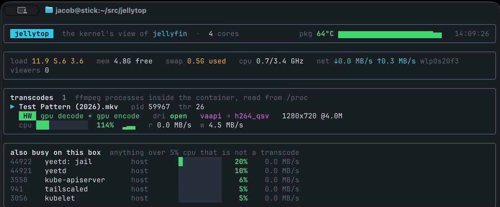
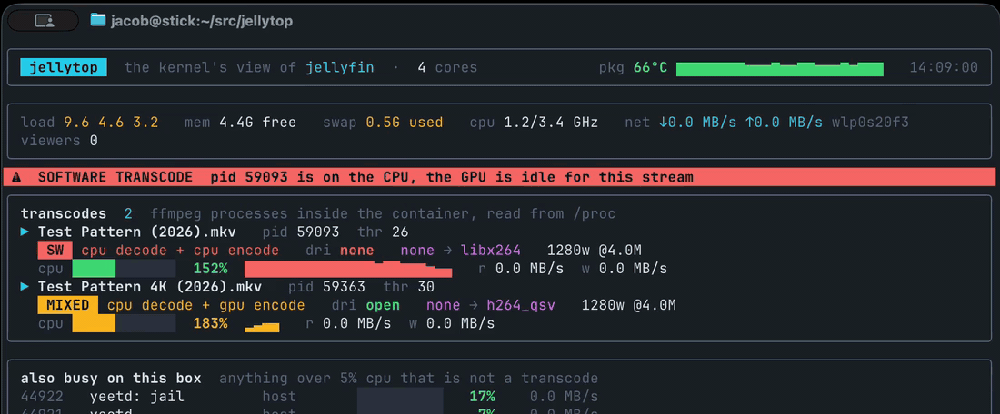

# jellytop

<p align="center">
  
  
  
  <a href="https://discord.gg/JxVseaAVAU"></a>
</p>



`top` for your Jellyfin transcodes, answered by the kernel. Jellyfin's
dashboard says *Transcoding* whether the GPU is doing the work or your CPU
is. jellytop reads what the kernel knows about every `ffmpeg` Jellyfin
spawns: whether it holds `/dev/dri/renderD*` open, what it was told to do,
the CPU it is billed, and what else on the box is busy at the same time.

```
$ yeet run github:yeet-src/jellytop | head -4
jellytop  container=jellyfin  transcodes=1   cpu pkg 54°C
  load 1.6 4.0 4.1   mem 4.8G free   swap 0.4G used   cpu 0.7/3.4 GHz   net ↓0.0 MB/s ↑0.5 MB/s wlp0s20f3

  PID     MODE   DRI   DECODE  ENCODE     TARGET           CPU% THR       READ      WRITE  FILE
  20858   hw     open  vaapi   h264_qsv   1280x720 @2800k   120  26   0.0 MB/s   4.6 MB/s  Test Pattern (2026).mkv
```

## Getting started

```sh
curl -fsSL https://yeet.cx | sh
yeet login
```

```sh
yeet run github:yeet-src/jellytop
```

That is the live view in your terminal; Ctrl+C exits. For the box in the
closet, install it as a service so it outlives your terminal:

```sh
git clone https://github.com/yeet-src/jellytop
cd jellytop
make up
```

The daemon restarts it if it dies and brings it up on boot. Its screen is
served on `ws://0.0.0.0:9297/tty`, so from the box or from your laptop over
the LAN or tailnet:

```sh
yeet dial ws://jellyfin-box:9297/tty    # your terminal becomes the TUI
make dial                               # the same, on the box
make down                               # stop and remove the service
```

Ctrl+C detaches; the service carries on. Jellyfin needs to be in Docker,
and the kernel has to be 6.6 or newer.

## Options

```sh
make up CONTAINER=media-server    # the container Jellyfin runs in (default jellyfin)
make up PORT=9300                 # where the /tty route is served (default 9297)
yeet run github:yeet-src/jellytop -- --interval 500
```

Piped or redirected, jellytop prints one text snapshot per tick instead of
drawing a TUI, so `yeet run github:yeet-src/jellytop | tee jellytop.log`
works.

A service snapshots the script when it is imported, so after editing
`main.tsx` run `make down && make up` rather than `yeet service restart`.

## What it shows



One card per transcode, read from `/proc`:

| Field | Source | Meaning |
|---|---|---|
| `MODE` | argv | `hw` hardware decode and encode, `mixed` one of the two, `sw` neither |
| `dri` | `/proc/<pid>/fd` | `open` if ffmpeg holds a `/dev/dri/renderD*` descriptor |
| `vaapi → h264_qsv` | `/proc/<pid>/cmdline` | the `-hwaccel` argument and the `-codec:v:0` encoder |
| target | `/proc/<pid>/cmdline` | output size from the scale filter and `-b:v` or `-maxrate` |
| `cpu` | `/proc/<pid>/stat` | `utime + stime` delta per tick, as a gauge scaled to the box's cores, with history |
| `r` / `w` | `/proc/<pid>/io` | bytes actually hitting storage |

A banner appears above the panel when any transcode is off the GPU: red for
`sw`, yellow for `mixed`. `mixed` is the one to watch for. The render node is
open and the encoder is `h264_qsv`, but there is no `-hwaccel`, so the decode
is on the CPU and the box is as busy as pure software.

The strip under the header is the box: load, memory free, swap in use, CPU
clock against its maximum, and throughput on the busiest physical interface.
The bottom panel lists every process over 5% CPU that is not a transcode,
with whether it lives in the Jellyfin container or on the host.

Container membership comes from the cgroup path, matched against the id the
Docker API reports for `--container`.

## What it does not do

- **Polls once a second.** An ffmpeg that exits in under one sample, such as
  a failed hwaccel init, can be missed; Jellyfin's transcode log has it. For
  every exec the instant it happens use
  [runfrom](https://github.com/yeet-src/runfrom).
- **No GPU utilization.** Intel iGPUs expose no counter the system graph
  reads; what the GPU is doing is inferred from the fd, the argv, and the CPU
  that is left over.
- **No viewer count.** Connections to a Docker-published port are NATed and
  do not appear in the host's TCP table.
- **Jellyfin outside Docker** needs the container filter removed in
  `main.tsx`.

## Read more

[Is Your Jellyfin Actually Using the GPU?](https://yeet.cx/blog/is-jellyfin-using-the-gpu)
covers how it works, with the code, and the three runs on an N100.
